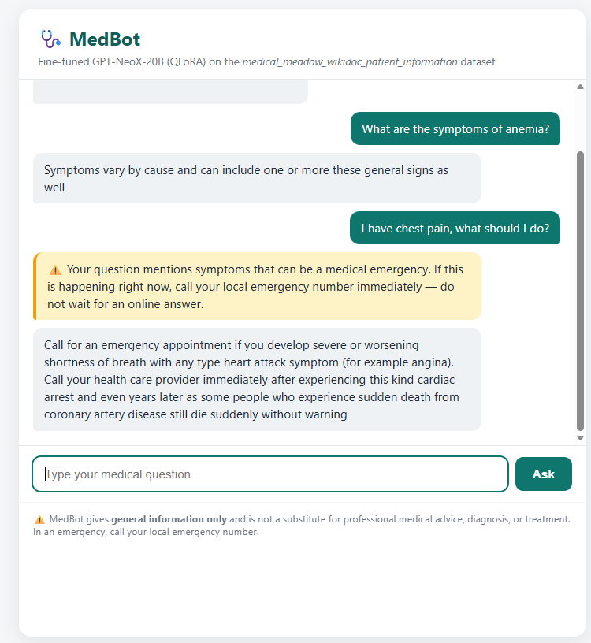

# 🩺 MedBot — Deployed Medical Q&A Chatbot

A patient-education chatbot built by fine-tuning **EleutherAI/gpt-neox-20b**
(20B parameters) with **QLoRA** (4-bit NF4 quantization + LoRA adapters) on the
[`medalpaca/medical_meadow_wikidoc_patient_information`](https://huggingface.co/datasets/medalpaca/medical_meadow_wikidoc_patient_information)
dataset, then deployed as a **Flask** web app inside a **Docker** container.

> ⚠️ **Disclaimer:** MedBot provides general medical information only. It is
> **not** a doctor, does not diagnose, and must never replace professional
> medical advice. In an emergency, call your local emergency number.


<!-- Extra Mile requirement: replace docs/demo.png with a real screenshot or
     GIF of the running app before pushing to GitHub. -->

---

## What the model does

- Answers general medical questions ("What are the symptoms of anemia?") in
  simple, patient-friendly language.
- Trained with label masking so the loss is computed only on answer tokens.
- Uses the **exact same prompt template at inference as during training**
  (instruction + question + `### Answer:`), which is essential for output
  quality.
- A **rule-based safety layer** checks every question for emergency keywords
  (chest pain, stroke, breathing problems, …) and always shows a "seek
  immediate care" banner — safety does not depend on the model alone.

## Architecture

```
Browser ──► Flask (app.py) ──► inference.py
                                  ├─ base model: gpt-neox-20b, 4-bit NF4 (bitsandbytes)
                                  ├─ LoRA adapter: pulled from HF Hub (ADAPTER_REPO)
                                  └─ emergency keyword safety layer
        ◄── JSON {answer, warning}
```

- The **Docker image contains no model weights** — the ~30 MB adapter and the
  quantized base are downloaded from the Hugging Face Hub on first start and
  cached. This keeps the image small and rebuilds fast.
- The model loads **lazily / in a background thread** so the container binds
  its port immediately and the hosting platform's health checks pass while
  weights download.

## Run it locally with Docker

**Without a GPU (UI + container smoke test):**

```bash
docker build -t medbot .
docker run -p 7860:7860 -e MOCK_MODE=1 medbot
# open http://localhost:7860
```

**With an NVIDIA GPU (real model, ≥16 GB VRAM recommended):**

```bash
docker run --gpus all -p 7860:7860 \
  -e MOCK_MODE=0 \
  -e ADAPTER_REPO=Abdelateef/medbot-lora \
  medbot
```

First start downloads ~12 GB of base-model weights (5–10 min). Check
progress at `http://localhost:7860/health`.

## Using the interface

1. Open the app URL.
2. Type a general medical question in the input box and press **Ask**.
3. The answer appears in the chat window. If your question mentions emergency
   symptoms, an orange warning banner appears first.
4. `POST /api/chat` with `{"question": "..."}` is also available as a JSON API,
   and `GET /health` reports model load status.

## Deployment (Hugging Face Docker Space)

1. Push the trained adapter to the Hub: run `upload_adapter.py` once in Colab.
2. Create a **Space → Docker** and upload this repo (this README's YAML header
   configures the Space).
3. In Space settings → Hardware, select **T4 small** (bitsandbytes 4-bit
   requires CUDA; free CPU hardware cannot run a 20B model).
4. Set Space variables: `ADAPTER_REPO=Abdelateef/medbot-lora`,
   `MOCK_MODE=0`.
5. Wait for build + model download, then share the public Space URL.

## Known issues & limitations

- **Requires a GPU** for real inference — 4-bit bitsandbytes kernels are
  CUDA-only. `MOCK_MODE=1` exists precisely so the container can still be
  demonstrated on CPU-only machines.
- **Hallucinations:** the model can produce confident but wrong medical
  statements (e.g., it once misdescribed a ventricular septal defect). This is
  why the disclaimer and safety layer exist, and why RAG over trusted medical
  sources is the main planned improvement.
- **Cut-off / narrow answers:** trained for only 100 steps on 900 examples due
  to Colab limits; some answers stop early or miss details.
- **Latency:** a 20B model on a T4 generates ~a few tokens/second; answers can
  take 20–60 s. One gunicorn worker with threads keeps `/health` responsive
  meanwhile.
- **Cold start:** first request after deployment waits for weight download.

## Project structure

```
├── app.py               # Flask app (UI route, /api/chat, /health)
├── inference.py         # model loading, prompt template, generation, safety layer
├── templates/index.html # chat interface
├── static/style.css     # styling
├── requirements.txt     # pinned dependencies
├── Dockerfile           # container definition (HF Spaces-compatible)
├── upload_adapter.py    # one-time: push LoRA adapter to HF Hub
└── docs/                # screenshots for this README
```
